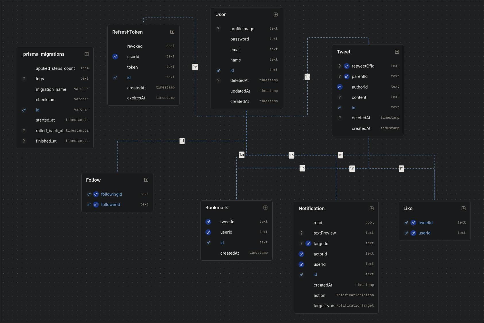

# Twitter-like Backend (Learning project)

Summary

- Twitter-like backend built with NestJS and TypeScript for learning purposes. Implements authentication, tweet posting, likes, bookmarks, follows, cursor-paginated feed, and real-time notifications via WebSockets.


Tech stack

- Language: TypeScript
- Framework: NestJS (v11)
- ORM: Prisma
- Database: PostgreSQL
- Cache / messaging: Redis (used as a Socket.IO adapter for notifications)
- WebSockets: Socket.IO + Redis adapter
- Containers: Docker / docker-compose
- Others: Passport (local + JWT), bcrypt, Zod, Axios, Cheerio


## Architecture diagram (assets)

The diagram is included in the `assets` folder:




Implemented features

- Authentication and authorization
  - Register and login with hashed password (`bcrypt`)
  - Authentication with JWT and refresh tokens
- Users
  - User profiles, profile image (field in the model)
  - Follow / unfollow users
- Tweets
  - Create, list and delete tweets
  - Likes and bookmarks (relations in the DB)
- Feed
  - Cursor-paginated feed (pagination DTOs)
  - Endpoint for timeline and to get a user's tweets
- Real-time notifications
  - WebSocket gateway at `src/modules/notifications/notifications.gateway.ts`
  - Redis adapter to scale the gateway across instances (if `REDIS_URL` is available)
- Private messaging (basic) via the `messages` module
- Trending / basic metrics
- Background job management (dependency `@nestjs/bull` present for jobs)
- Migrations and models managed with Prisma (`prisma/schema.prisma` and `prisma/migrations`)

Architecture and code organization

- Code organized by modules under `src/modules/` (e.g., `auth`, `users`, `tweets`, `feed`, `notifications`, `messages`, `trending`).
- `src/main.ts` and `src/app.module.ts` act as the NestJS entry and initialization points.
- `src/database/prisma.service.ts` encapsulates the Prisma client.
- DTOs and validations use `class-validator` and `class-transformer`.

Docker and local deployment

- Main services are defined in [docker-compose.yml](docker-compose.yml):
  - `db` (Postgres)
  - `redis` (Redis)
  - `backend` (this application)

Common commands

- Start dependencies with Docker (Postgres + Redis):

```bash
docker-compose up -d db redis
```

- Install dependencies and run in development mode:

```bash
npm install
npm run start:dev
```

- Prisma migrations and DB reset:

```bash
# Apply migrations
npx prisma migrate deploy
# Or in development
npx prisma migrate dev
# Reset the database (DANGER: deletes all data)
npx prisma migrate reset --force
```

- Alternative to reset schema using the container if applicable:

```bash
# From the backend container (if Prisma is installed inside)
# or with npx from the host (see above)
```

Relevant environment variables

- `DATABASE_URL` — Postgres connection URL (e.g. `postgres://user:pass@db:5432/twitter`)
- `REDIS_URL` — Redis URL (e.g. `redis://redis:6379`) (used by the Socket.IO adapter)
- `JWT_SECRET` — secret key used to sign JWTs
- `NODE_ENV`, `PORT` and others as referenced in `src/main.ts` and the Docker configuration.

Redis usage in this project

- Redis is currently used as the Socket.IO adapter in `src/modules/notifications/notifications.gateway.ts` to enable real-time notifications across instances.
- It is not used as a general cache (for example, `cache-manager` is not integrated in the current codebase).


Main endpoints (summary)

- `POST /auth/register` — Register a new user
- `POST /auth/login` — Login and receive tokens
- `POST /tweets` — Create a tweet
- `GET /feed` — Get the feed (cursor-paginated)
- `POST /tweets/:id/like` — Like a tweet
- `POST /bookmarks` — Create a bookmark (bookmarks module)
- WebSocket `/notifications` — Connect for real-time notifications

(This is a summary; see controllers under `src/modules/*/*.controller.ts` for full routes and details.)
